# Linux OS Kernel - Side Projects

### 一、作業目標　[NCU 許富皓 教授 Guide line](https://staff.csie.ncu.edu.tw/hsufh/COURSES/FALL2023/linux_project_1.html)
撰寫 system call 利用 `user_get_physical_addresses()` 進行呼叫，來獲得每個 process 的 virtual address 對應到的 physical address。

接著寫一個 multi-thread 的程式，觀察被這些 threads 所共享的 memory areas，了解各個 segment 的共用狀況，並繪圖說明。
* text segments (code segment)
* data segments (**global / static** variables with **initial values**)
* BSS segments (**global / static** variables with **uninitial values**)
* heap segments (dynamic variables)
* stack segments (local variables)
* libraries
* thread local storages
<p align="left">
  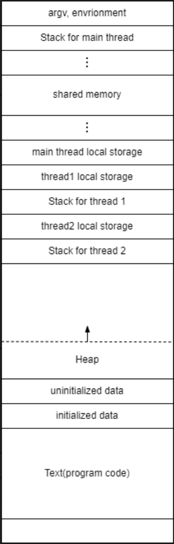
</p>
只要 variable 的 virtual address 指向相同的 physical address 時，就代表他們有 share memory，所以主要的目標分為以下：
1. 寫一個 system call 負責將 virtual address 轉成 physical address。
2. 將此 system call 編入 kernel 當中。
4. 利用 multi-thread 呼叫此 system call，觀察其 physical address 是否相同，可以了解其中的共享狀況。

### 二、環境、系統 (Environment)
* CPU
  - 13th Gen Intel(R) Core(TM) i7-13620H
* OS： ubuntu 24.04.3 desktop
  - ubuntu下載點：https://ubuntu.com/download/desktop
* Kernel 版本： 5.15.137
  - kernal下載點：https://www.kernel.org/

### 三、編譯核心程式 (Implement)
 * #### Test Compile Kernel by [`sys_hello_linux_test`](https://github.com/PlusRon/linux_kernel/tree/dfb34fc8868444c24ec5a50ebf876bce85c18a00/hello_linux_test)
   - [編譯前置作業、新增測試 `sys_hello_linux_test`、編譯過程、除錯DEBUG](https://github.com/PlusRon/linux_kernel/blob/89e90abb961bae78b8029354d4174b41d607229e/hello_linux_test/README_syscall_hello_linux_test.md)
 * #### Add syscall [`sys_get_physical_addresses`](https://github.com/PlusRon/linux_kernel/tree/dfb34fc8868444c24ec5a50ebf876bce85c18a00/get_physical_addresses) to get physical address from virtual address traversal level by level.
   - [設計 5-Layer Page Table Traversal(PGD、P4D、PUD、PMD、PTE) 、新增 `sys_get_physical_addresses`、編譯過程](https://github.com/PlusRon/linux_kernel/blob/89e90abb961bae78b8029354d4174b41d607229e/get_physical_addresses/README_syscall_get_physical_addresses.md)

### 四、成果 (Result)
  * #### Segment 的共用狀況
    
  * #### User Space (`bash build.sh`)
    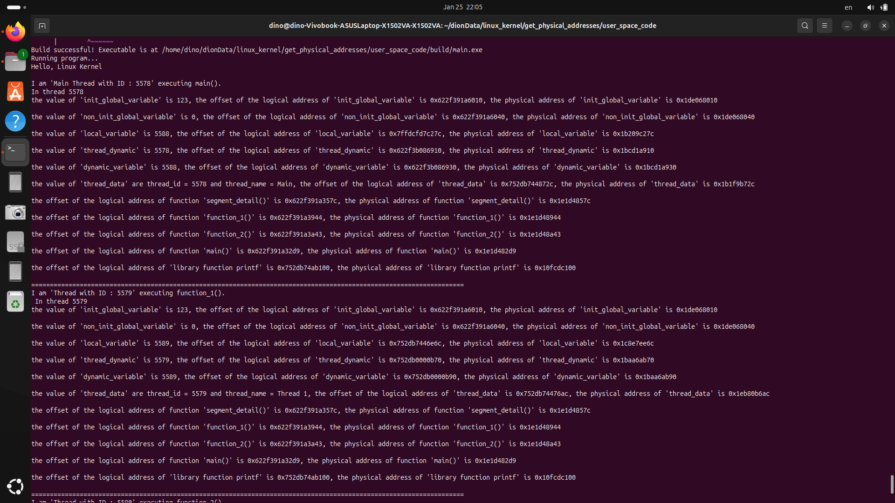
  * #### Kernel Space (`sudo dmesg`)
    <p align="left">
      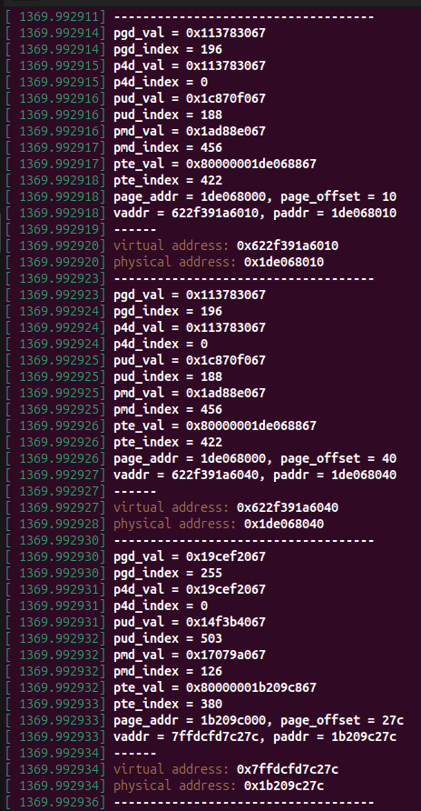
      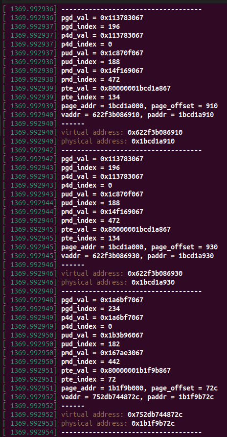
      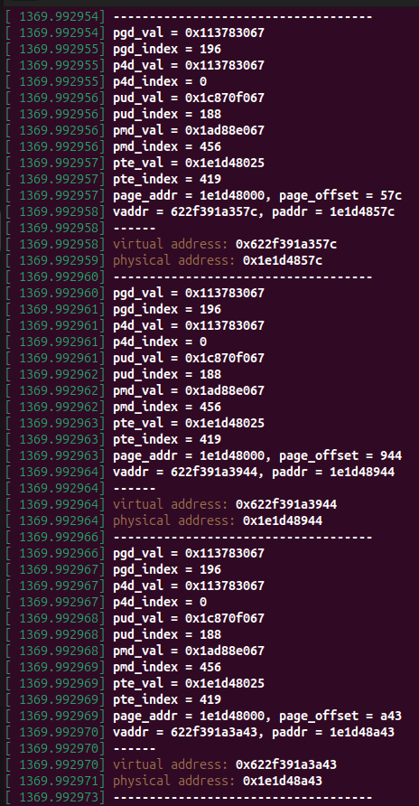
      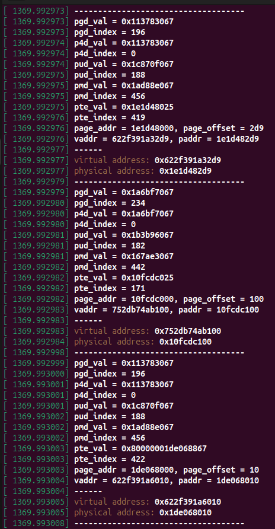
      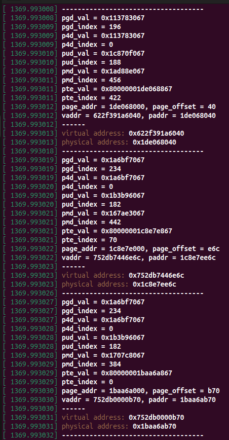
      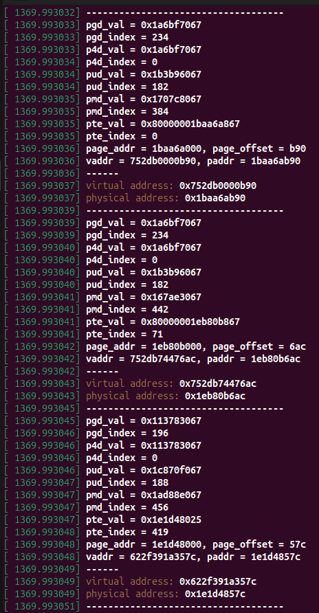
      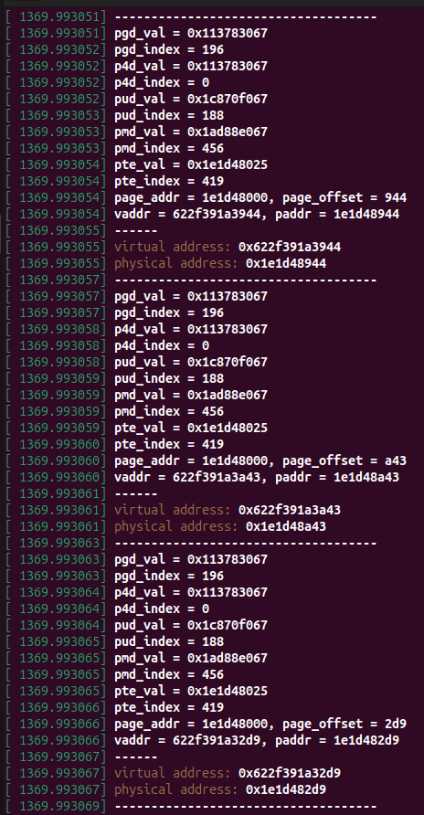
      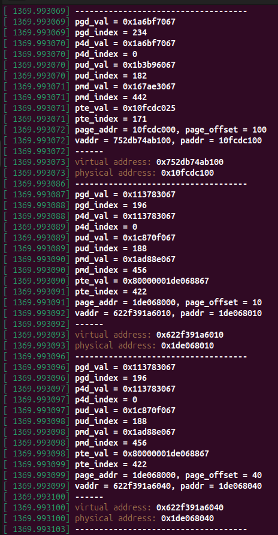
      
      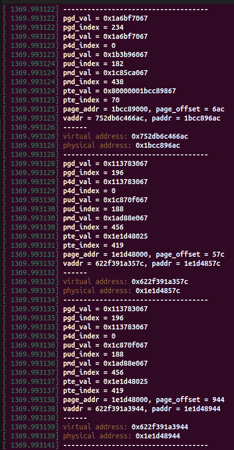
    </p>
    
### 五、問題與探討 (Issues and Discussions)
  * #### shim signature of Security Boot failed.
    ```
    # ERROR
    make[1]: *** No rule to make target ‘certs/rhel.pem’, 
    needed by ‘certs/x509_certificate_list’. 
    Stop. make: *** [Makefile:1729: certs] Error 2

    # Solution : 將此兩變量賦值為空值 不去找 shim signature 路徑
    CONFIG_SYSTEM_TRUSTED_KEYS=""
    CONFIG_SYSTEM_REVOCATION_KEYS=""
    ```
  * #### pahole of `BTF_DEBUG` is not available.
    ```
    # ERROR
    BTF: .tmp_vmlinux.btf: pahole (pahole) is not available
    Failed to generate BTF for vmlinux
    Try to disable CONFIG_DEBUG_INFO_BTF
    make: *** [Makefile:1227: vmlinux] Error 1
   
    # Solution : 
    $ cd /usr/src/linux-5.15.137中
    $ vim .config 
    # 依序將這兩個進行 disable
    CONFIG_DEBUG_INFO = n
    CONFIG_DEBUG_INFO_BTF = n
    ```
  * #### `make -j$(nproc)` 失敗
    ```
    # ERROR
    sed: can't read modules.order: No such file or directory
    make: *** [Makefile:1544: __modinst_pre] Error 2

    # Solution : 
    重新編譯 make -j$(nproc)
    ```
  * #### DKMS (Dynamic Kernel Module Support) 編譯錯誤
    ```
    # ERROR
    Error! One or more modules failed to install during autoinstall.
    Refer to previous errors for more information. 
    * dkms: autoinstall for kernel 5.15.137 [fail] run-parts: 
    /etc/kernel/postinst.d/dkms exited with return code 11make: 
    *** [arch/x86/Makefile:266: install] Error 11

    # Solution : 
    # 查看具體的編譯日誌
    $ ls /var/lib/dkms/
    # 查看目前的 dkms 狀態
    $ dkms status
    # 移除失敗的模組（以 nvidia 為例，版本號請依 status 結果而定）  
    $ sudo dkms remove -m mt7902 -v 0.0.1 -k 5.15.137
    # 再次嘗試 $ sudo make install 就不會再報錯
    ```
  * #### bad shim signature :  UEFI 韌體 偵測到自行編譯的核心 沒經過數位簽署，拒絕啟動該核心
    ```
    # ERROR
    Loading Linux 5.15.137...
    error : bad shim signature.
    loading initial ramdisk...
    error: you need to load the kernel first.

    # Solution : 
    Method_1. 關閉 Secure Boot (最快且最推薦)
    Method_2. 產生金鑰並將其匯入 UEFI，然後簽署核心
    ```
  * #### initramfs (initial RAM filesystem) : 抓不到臨時根目錄
    ```
    # ERROR
    (initramfs) exit
    ALERT! UUID=46a...5921 does not exist . Dropping to a shell!

    (initramfs) ls /sys/bus/pci/devices/*/device
    0xa715
    ....
    ....
    0x7902

    (initramfs) dmesg | grep -i vmd
    ACPI: UEFI 0x00000716A.... (v01 INTEL RstVmdE 00000000 INTL 00000000)
    ACPI: UEFI 0x000007169.... (v01 INTEL RstVmdV 00000000 INTL 00000000)

    (initramfs) dmesg | grep -i nvme
    ls: /dev/nvme*: No such file or directory

    (initramfs) ls /sys/class/nvme

    (initramfs) cat /proc/partitions
    major minor #block name

    (initramfs) dmesg | grep -i error
    [Firmware Bug] : TSC ADJUST differ with in socket(s), fixing all errors
    RAS: Correctable Errors collector initialized 
    ```

### 六、參考 (Reference)
  * [How to get physical address (Memory Management)](https://stackoverflow.com/questions/41090469/linux-kernel-how-to-get-physical-address-memory-management)
  * [Page Table Traversal 機制 程式碼實現](https://zhuanlan.zhihu.com/p/436879901)
  * [`copy_from_user()`用法](https://www.cnblogs.com/Rainingday/p/12618715.html)
  * [`copy_to_user()`用法](https://blog.csdn.net/qq_30624591/article/details/88544739)
  * [`/arch/alpha/include/asm/page.h` #define](https://elixir.bootlin.com/linux/v4.6/source/arch/alpha/include/asm/page.h#L10)
  * [如何開啟 GRUB 選單](https://magiclen.org/grub-menu/)

