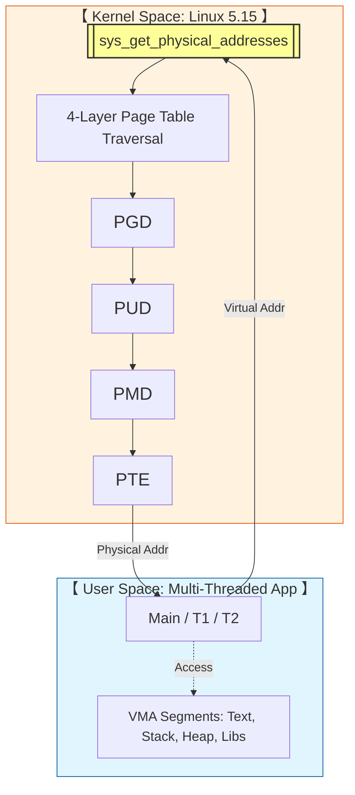
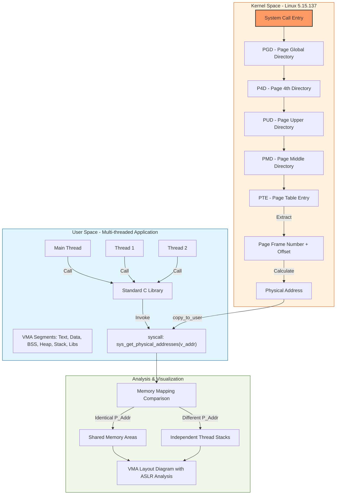

### System Architecture
#### Final Version

```mermaid

graph TD
    

    subgraph Kernel_Space ["<span style='font-size:20px'>【 Kernel Space: Linux 5.15 】<span/>"]
        SYSCALL[["<span style='font-size:20px'>sys_get_physical_addresses<span/>"]]
        MMU["<span style='font-size:20px'>4-Layer Page Table Traversal<span/>"]
        %% PGD[PGD] --> P4D[P4D] --> PUD[PUD] --> PMD[PMD] --> PTE[PTE]
        PGD["<span style='font-size:24px'>PGD<span/>"] --> PUD["<span style='font-size:24px'>PUD<span/>"] --> PMD["<span style='font-size:24px'>PMD<span/>"] --> PTE["<span style='font-size:24px'>PTE<span/>"]
        SYSCALL --> MMU
        MMU --> PGD
    end
    subgraph User_Space ["<span style='font-size:20px'>【 User Space: Multi-Threaded App 】<br><span/>"]
        
        Threads["<span style='font-size:20px'>Main / T1 / T2<span/>"]
        VMA["<span style='font-size:18px'>VMA Segments: Text, Stack, Heap, Libs<span/>"]
        Threads -.->|Access| VMA
    end

    Threads -->|Virtual Addr| SYSCALL
    PTE -->|Physical Addr| Threads

    style SYSCALL fill:#ff9,stroke:#333,stroke-width:2px
    style Kernel_Space fill:#fff3e0,stroke:#e65100
    style User_Space fill:#e1f5fe,stroke:#01579b
```

#### Version 1

```mermaid
graph TD
    subgraph User_Space [User Space - Multi-threaded Application]
        A[Main Thread] & B[Thread 1] & C[Thread 2]
        D[VMA Segments: Text, Data, BSS, Heap, Stack, Libs]
        
        A & B & C -->|Call| E[Standard C Library]
        E -->|Invoke| F["syscall: sys_get_physical_addresses(v_addr)"]
    end

    subgraph Kernel_Space [Kernel Space - Linux 5.15.137]
        G[System Call Entry] --> H[PGD - Page Global Directory]
        H --> I[P4D - Page 4th Directory]
        I --> J[PUD - Page Upper Directory]
        J --> K[PMD - Page Middle Directory]
        K --> L[PTE - Page Table Entry]
        
        L -->|Extract| M[Page Frame Number + Offset]
        M -->|Calculate| N[Physical Address]
        
        N -->|copy_to_user| F
    end

    subgraph Analysis_Result [Analysis & Visualization]
        F --> O[Memory Mapping Comparison]
        O -->|Identical P_Addr| P[Shared Memory Areas]
        O -->|Different P_Addr| Q[Independent Thread Stacks]
        
        P & Q --> R[VMA Layout Diagram with ASLR Analysis]
    end

    style G fill:#f96,stroke:#333,stroke-width:2px
    style User_Space fill:#e1f5fe,stroke:#01579b
    style Kernel_Space fill:#fff3e0,stroke:#e65100
    style Analysis_Result fill:#f1f8e9,stroke:#33691e

```
